# 🏠 Real Estate Intelligence — User Guide

A screenshot-led tour of the map, house views, and chat workflows. For the project
overview and complete technical and setup documentation, see the [README](README.md).

> **About the screenshots in this guide.** These were captured from the local application
> and database on September 27, 2026. At capture time the database contained 1,778 houses,
> 85,154 NRI records, 450 bike routes, ~5.9 M ZHVI rows, and ~80 K Market Heat Index rows.
> Your screens will vary with the data loaded in your own database. Some views below
> reflect data or services that were unavailable in this local run; those states are called
> out where they appear.

---

## Contents

1. [Before you start](#before-you-start)
2. [The map](#the-map)
3. [The house sidebar](#the-house-sidebar)
4. [House Chat](#house-chat)
5. [General Chat](#general-chat)
6. [Map layers](#map-layers)
7. [Bike route planner](#bike-route-planner)
8. [Commute times](#commute-times)
9. [The Data page](#the-data-page)
10. [Keeping data fresh](#keeping-data-fresh)
11. [Troubleshooting](#troubleshooting)
12. [Privacy](#privacy)

---

## Before you start

Follow the README for [prerequisites](README.md#prerequisites), [quick start](README.md#quick-start),
and [data sources](README.md#data-sources), including where files go and which datasets are
optional. At minimum, load a Redfin favorites export to see houses on the map.

---

## The map

The map opens centered on the US with your houses clustered by location. Zoom in and
clusters break apart into individual pins.

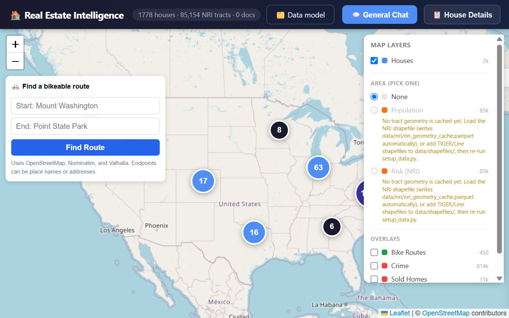

- **Cluster badges** show how many houses are nearby — click one to zoom in.
- **♡ / heart-shaped markers** are houses you've favorited (toggle from the sidebar).
- For marker colors and the other basic map controls, see the README's [Usage Guide](README.md#usage-guide).

Zoomed into a city, individual houses are easy to pick out — including the mix of
favorited (heart) and non-favorited (plain pin) markers:

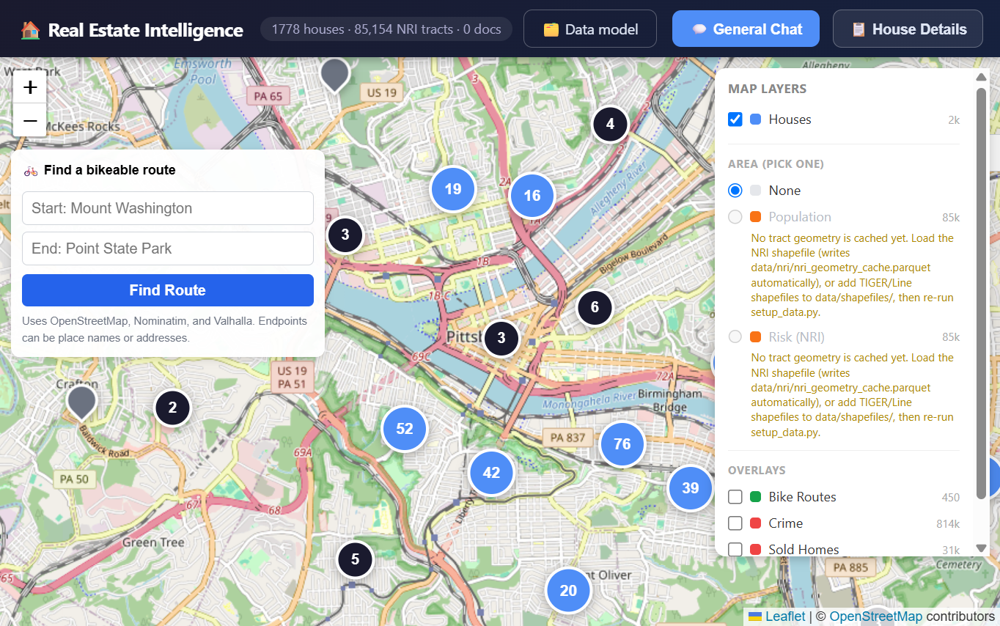

The **🚲 Find a bikeable route** box in the top-left and the **Map Layers** panel in the
top-right are both always available. See the README for [bike routing](README.md#bike-routing)
and [map layers](README.md#map-layers).

---

## The house sidebar

Click a marker (or the **📋 House Details** button) to open the sidebar. It has six tabs:
**Details, Risk, Commute, Chat, Docs**, and **General**.

### Details

See the README's [Usage Guide](README.md#usage-guide) for the sidebar contents.

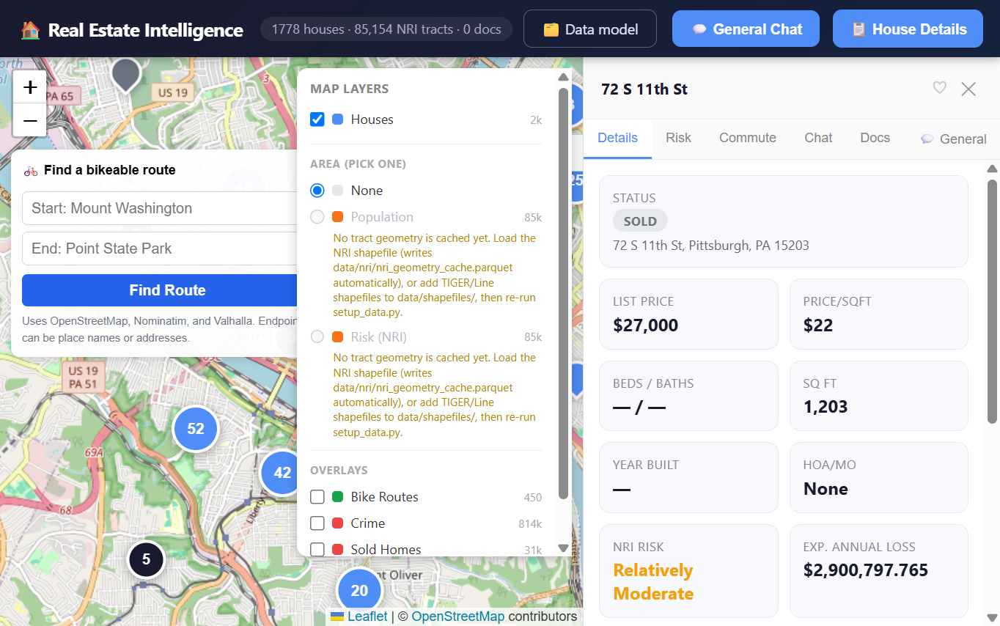

### Risk

The screenshot shows the risk view; the README's [Usage Guide](README.md#usage-guide)
summarizes the risk fields.

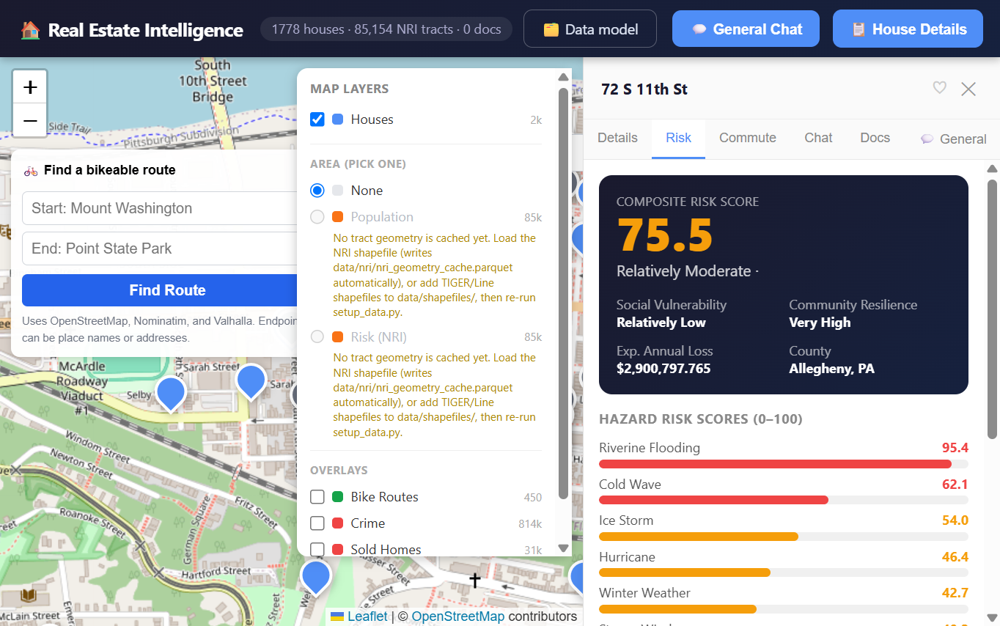

### Commute

See the README's [Commute times](README.md#commute-times) section for setup and behavior.

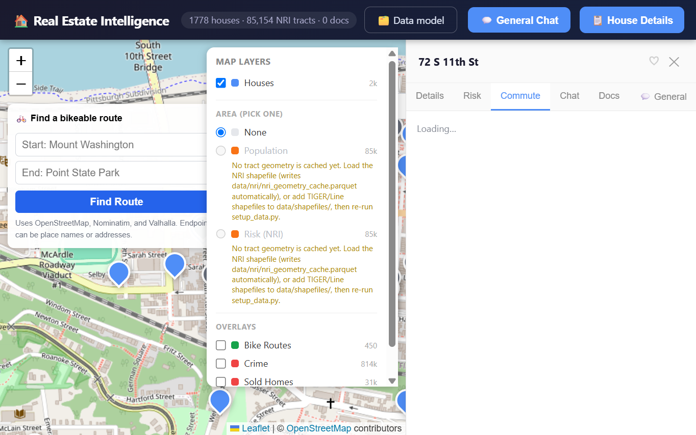

In this local run, the commute configuration endpoint returned an HTTP 500 error, so
the tab remained in its loading state rather than showing estimates.

### Docs

See the README's [Usage Guide](README.md#usage-guide) for the Docs tab contents.

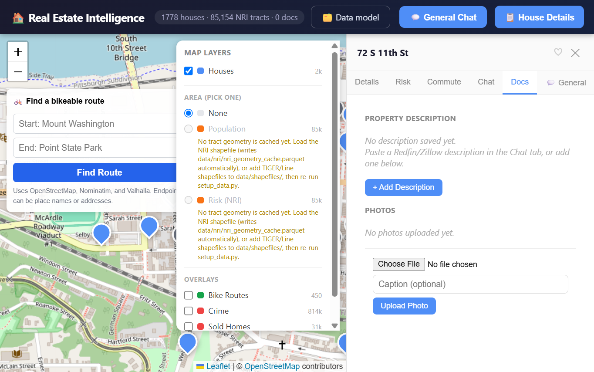

### Chat & General

The README's [Usage Guide](README.md#usage-guide) summarizes the sidebar tabs and both chat
workflows. The screenshots below show them in context.

---

## House Chat

Ask this house's assistant about price, risk, or anything you've pasted in. It has
access to this specific property's data (and any comps in the same city) — it does
not compare across the whole map like General Chat does.

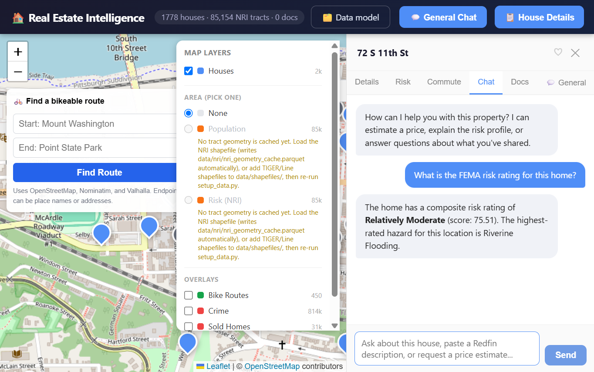

For example questions and details about what House Chat can query, see the README's
[Usage Guide](README.md#usage-guide) and [capability matrix](README.md#capability-matrix).

---

## General Chat

Open with the **💬 General Chat** button in the top bar, or the **General** tab inside
any house's sidebar. This assistant can reason across *every* house, city, and dataset
you've loaded — not just the one you have open.

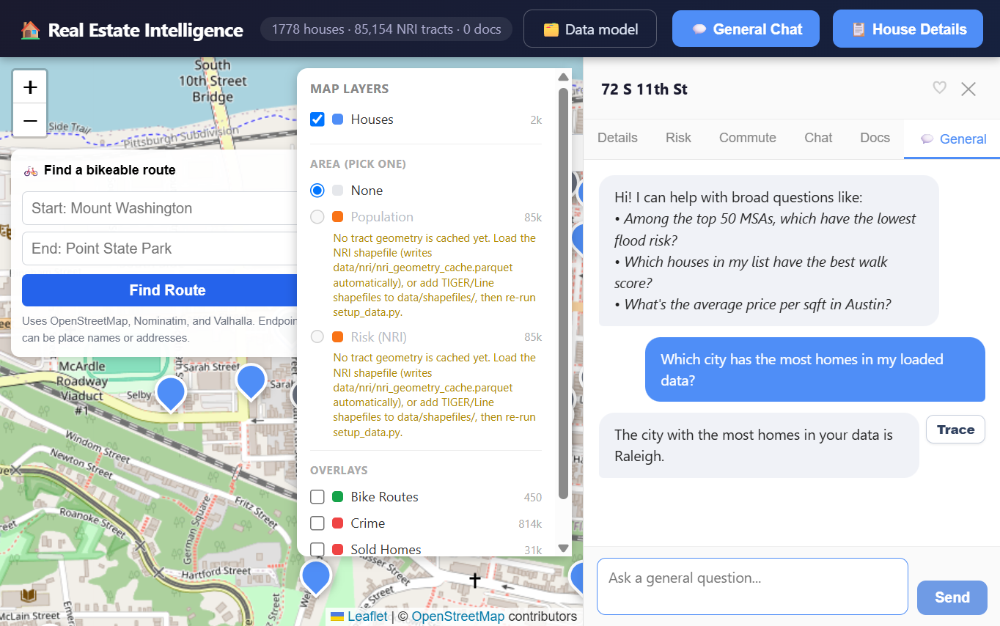

For example questions and supported query areas, see the README's [Usage Guide](README.md#usage-guide)
and [capability matrix](README.md#capability-matrix).

---

## Map layers

The **Map Layers** panel (top-right) controls what's drawn on the map. For the available
layers, combination rules, and how approved datasets appear automatically, see the README's
[Map layers](README.md#map-layers) section.

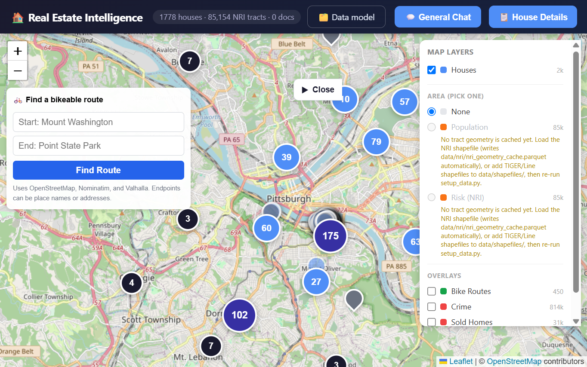

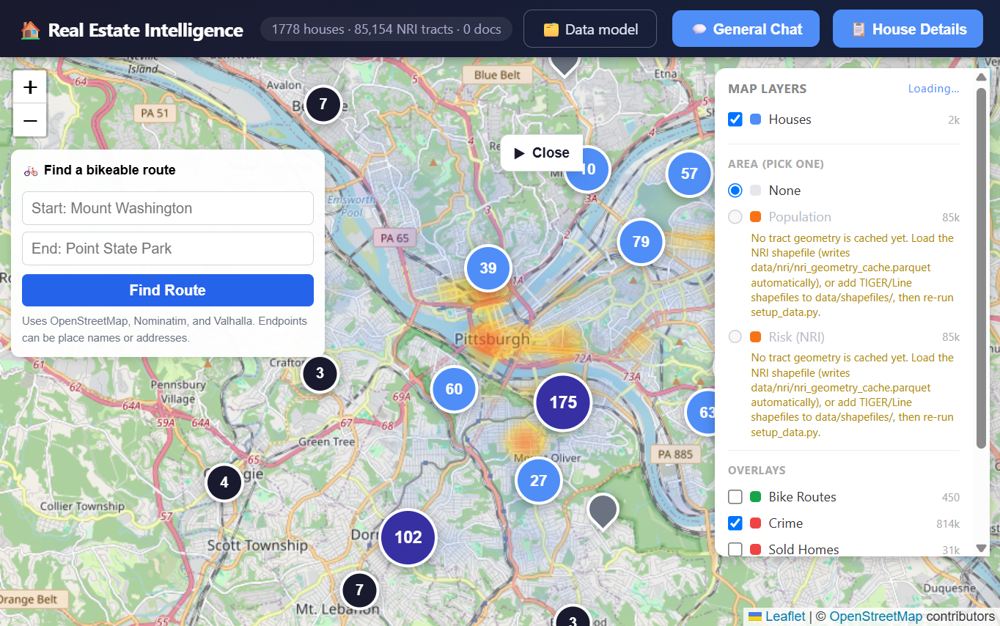

### Crime heatmap & year-by-year animation

When the **Crime** layer is turned on, the panel exposes historical filtering controls directly
inferred from the local crime database:

- **Year dropdown**: Displays all distinct years present in the dataset alongside an **"All years"** default.
  Selecting a single year scopes the heatmap aggregation strictly to incidents from that year, updating
  the map cells and the legend title (e.g. `Crime density (2020)`).
- **▶ Animate button**: Automatically steps forward through all available years at 1 frame per second.
  - **Constant density legend**: While animating, the color density gradient scale is locked across
    all years using the peak single-year density within the active viewport (`— scale locked` indicator).
    This ensures that red, orange, and blue intensities represent the exact same absolute incident
    densities from year to year, making multi-year trends and hotspots directly comparable without visual distortion.
  - **Interactive controls**: The year dropdown advances in sync with each frame. Clicking **⏹ Stop**,
    selecting any year manually from the dropdown, or unchecking the layer immediately halts the animation
    and returns the scale to standard mode.

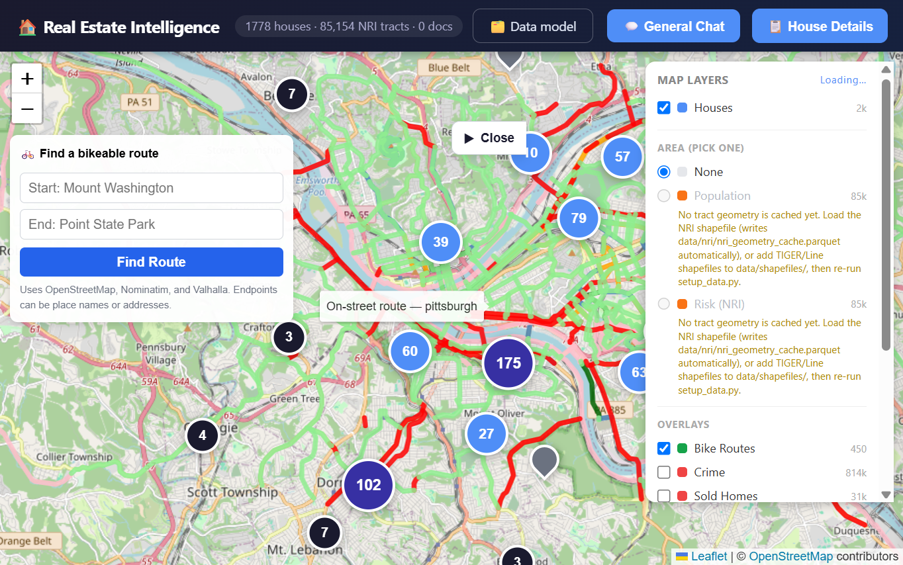

To add a dataset that can appear as a layer, see [The Data page](#the-data-page) and the README's
[Map layers](README.md#map-layers) documentation.

---

## Bike route planner

The control in the map's top-left finds a route on the locally ingested bike network.
See the README's [Bike routing](README.md#bike-routing) section for supported endpoints,
route behavior, and the services involved.

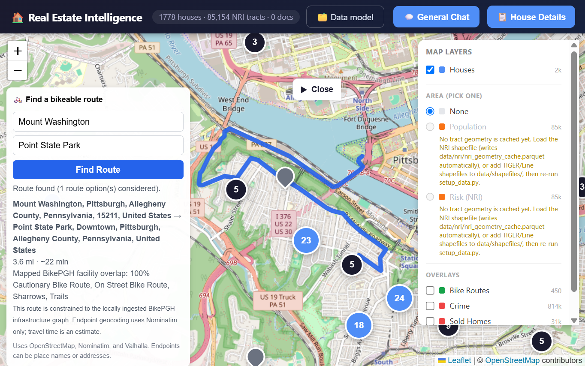

The result panel shows distance, estimated time, and the route's overlap with mapped bike
facilities.

---

## Commute times

Commute setup, estimates, supported modes, privacy implications, and self-hosting
instructions are documented in the README's [Commute times](README.md#commute-times) section.

---

## The Data page

Click **🗂️ Data model** in the top bar to see the catalog and add datasets. The README's
[Data page](README.md#the-data-page) section documents the catalog, upload and approval workflow,
and what the chats gain from approved datasets.

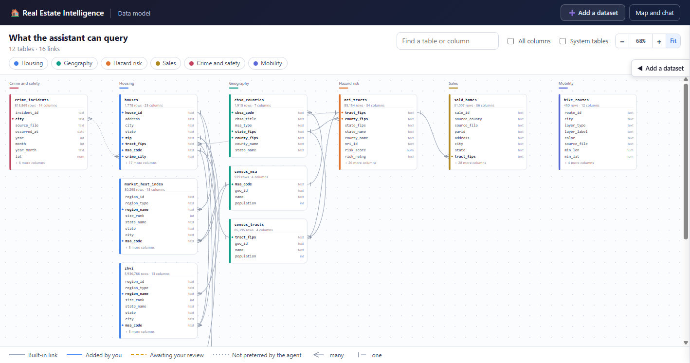

The page also lets you upload a dataset, review proposed links, and approve it. See the
README's [Adding New Data Sets](README.md#adding-new-data-sets) section for the ingestion paths.

---

## Keeping data fresh

After adding new files, reload just what changed:

```bash
python setup_data.py --only redfin    # just Redfin
python setup_data.py --only sold      # just sold homes
python setup_data.py --only crime     # just crime data
python setup_data.py --only bike      # just BikePGH route data
python setup_data.py --only census    # CBSA crosswalk + tract/MSA populations
python setup_data.py --only zhvi      # just Zillow Home Value Index
python setup_data.py --only market_heat_index  # just Zillow Market Heat Index
python setup_data.py --only geocode   # retry pending sold-home geocodes
python setup_data.py --only match     # link sold records to houses
python setup_data.py --resolve-tracts # resolve missing house tract FIPS values
python setup_data.py                  # everything
```

The vector database also grows on its own — every description you paste into House Chat
is saved automatically.

---

## Troubleshooting

| Issue | Fix |
|---|---|
For setup and data-loading issues, see the README's [Troubleshooting](README.md#troubleshooting)
table. The README also documents [data sources](README.md#data-sources) and [bike routing](README.md#bike-routing).

---

## Privacy

- The README documents network use for [bike routing](README.md#bike-routing) and
  [commute times](README.md#commute-times).
- **Commute times** use public routing servers by default. See the README's [Commute times](README.md#commute-times)
  section for the exact data sent and self-hosting instructions.
- Everything else — your houses, descriptions, photos, risk data, and chat history —
  stays in the local DuckDB/Chroma files under `data/`.
